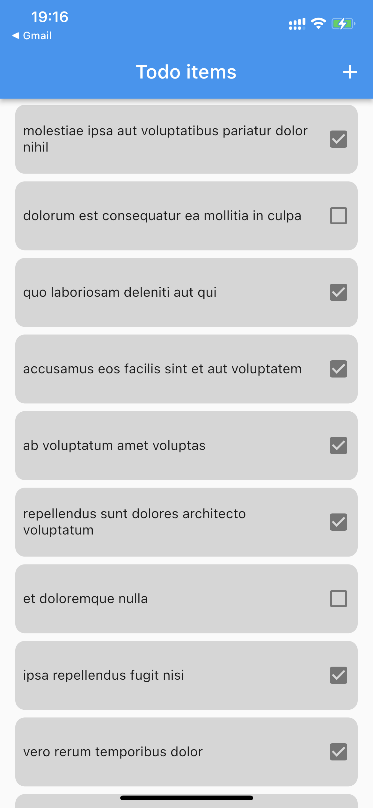
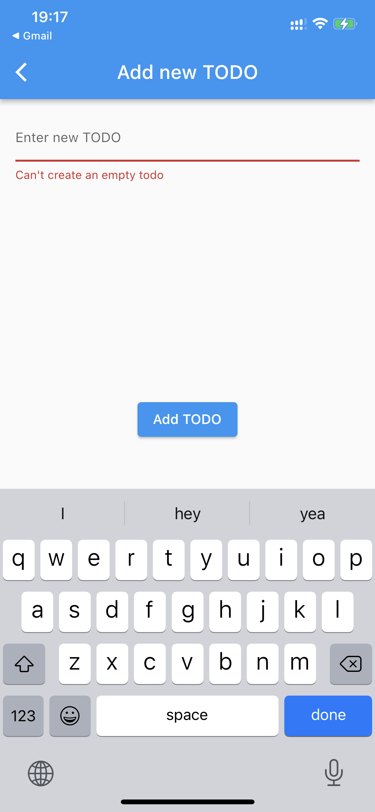

# todo_app

A test assignment for Flutter Tech Lead/Senior Flutter developer position application at Knowunity.

## Requirements

[Initial requirements](requirements/Flutter%20Case%20Study.pdf)

Additional Requirements:
It's a personal todo application. There should be local storage for data.


## Implementation

Hive is used as a local storage solution.

## Results
  


## Running the project

Flutter version used for the project:
```
Flutter 3.3.2 • channel unknown • unknown source
Framework • revision e3c29ec00c (8 months ago) • 2022-09-14 08:46:55 -0500
Engine • revision a4ff2c53d8
Tools • Dart 2.18.1 • DevTools 2.15.0
```

In order to regenerate Hive adapter model run
```
flutter pub run build_runner watch --delete-conflicting-outputs 
```

